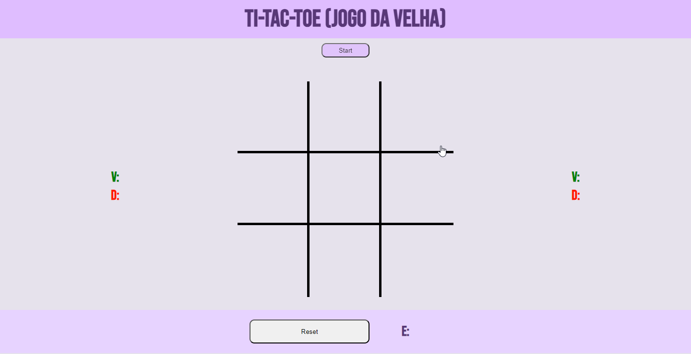
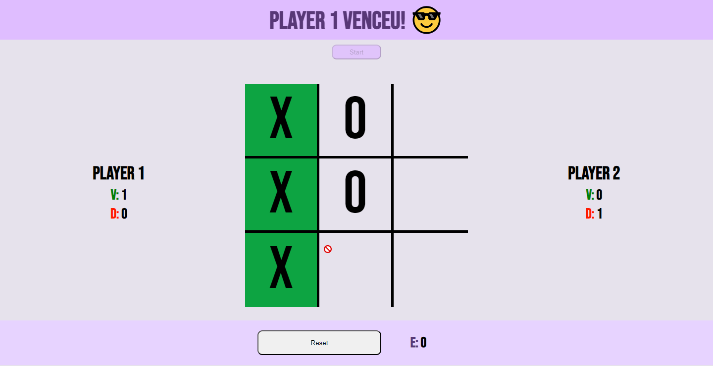

# :hash: TIC-TAC-TOE (JOGO DA VELHA)

> Demonstação visual do Jogo.

### :spiral_notepad: Ajustes e melhorias

O projeto ainda está em desenvolvimento e as próximas atualizações serão voltadas nas seguintes tarefas:

- [ ] Responsividade.
- [ ] Correção de bugs.
- [ ] Limpreza/tratamento do codigo.
- [ ] Documentação.

## :smiley: Colaboradores

Agradecemos à seguinte pessoa por contribuír para este projeto:

<table>
  <tr>
    <td align="center">
      <a href="#">
         
        
          <b>César Willemberg</b>
        
      </a>
    </td>
  </tr>
</table>

## :handshake: Seja um dos contribuidores

Quer fazer parte desse projeto? Clique [AQUI](CONTRIBUTING.md) e leia como contribuir.

## :memo: Licença

Esse projeto está sob licença. Veja o arquivo [LICENÇA](LICENSE.md) para mais detalhes.